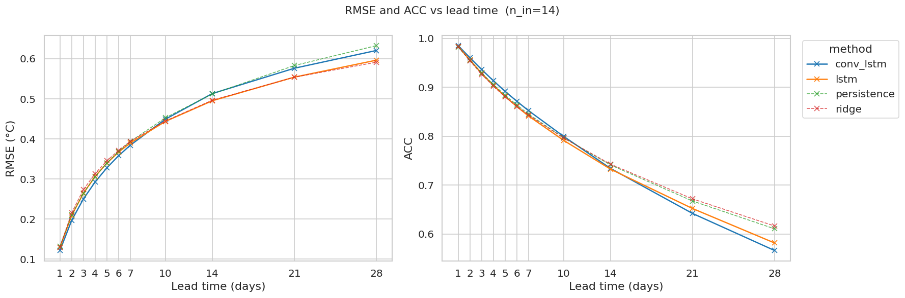
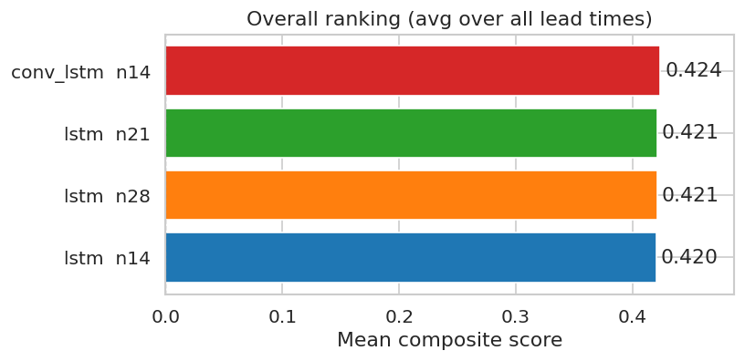

## SST Anomaly Forecasting

A deep-learning forecasting pipeline predicts daily SST anomalies up to 28 days ahead (referred to as *lead times*). The pipeline is trained on 1982–2014, validated on 2015–2019, and evaluated on the held-out test period 2020–2025. We call `n_in` the input window length, for example, with `n_in=14` the model observes the past 14 days of SSTA to predict the next day (`n_out=1`).

### Models and Baselines

| Method | Baseline | Description |
|---|---|---|
| Baseline | `Persistence` | Assumes today's SST anomaly persists unchanged across all future lead times. Considered a hard-to-beat baseline for short-term ocean forecasting. |
| Baseline | `Ridge` | One Ridge regression model trained independently per lead time, pooled across over all ocean pixels |
| Model | `PixelLSTM` | simple LSTM model applied independently to each pixel using a temporal input window of `n_in` days. Captures temporal dynamics but ignores spatial context. |
| Model | `ConvLSTMForecast` | Extends PixelLSTM with convolutional layers to incorporate neighboring spatial information.  Combines temporal and spatial modeling. |

Both `PixelLSTM` and `ConvLSTMForecast` models are **autoregressive models trained with a rollout strategy**: rained to predict a single day ahead (`n_out=1`), with predictions fed back as inputs for the next step, repeated up to 28 times. This means **errors accumulate** at each step: a small mistake at day 2 becomes an input for day 3, and continue up to day 28.
Future work should focus on training **Direct Models** that predict all lead times (`n_out=28`) days to remove the accumulation effect.

All models are intentionally lightweight (training < 100 epochs, small batchsize) du to hardware constraints. More complex architectures and longer training runs would likely give significant performance gains.

## Performance Analysis
A detailed analysis is available in [`results_analysis.ipynb`](../notebook/results_analysis.ipynb). The figures below summarize the key results.

### skill score across lead times and model configurations:

`conv_lstm n14` achieves the highest skill score at short lead times (0.508 at t=1), however, its advantage erodes progressively with lead time, and by `t=28` it has the lowest score among all configurations (0.312), suggesting that spatial context helps most when the forecast is close to the input window, but becomes less impactful as rollout errors dominate. The three LSTM variants (n14, n21, n28) perform very similarly across all lead times, with differences below 0.01. This shows that increasing the input window length provides no meaningful benefit when the bottleneck is rollout error accumulation rather than insufficient historical context.

### RMSE and ACC vs. lead time:

All methods start from a near-identical point at t=1 (RMSE ≈ 0.13°C, ACC ≈ 0.98) and degrade with lead time as expected. Both deep learning models achieve slightly lower RMSE than the baselines at longer lead times, but the ACC picture is more nuanced: beyond t=21 days, persistence and ridge actually outperform `conv_lstm` and `lstm` on ACC. This divergence between RMSE and ACC at long horizons is a direct signature of rollout degradation.

### Overall ranking (mean composite score across all lead times):

All four configurations cluster tightly between 0.420 and 0.424, a spread of just 0.004. While `conv_lstm n14` ranks first, the margin is negligible and not practically significant. The main conclusion is that the dominant limiting factor is the autoregressive rollout strategy shared by all models, not the architecture or input window choice. Addressing this through a direct forecasting approach is likely to produce larger gains than any further tuning of the current setup.
